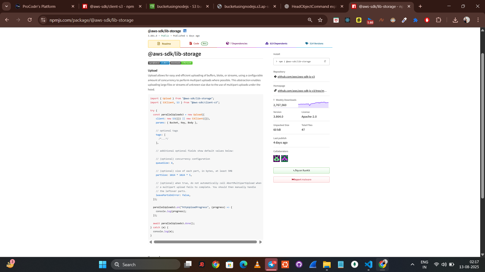

Download this package @aws-sdk/lib-storage , and by that, we can upload  files with Progress View . 

So basically, what we do is just divide it to a full video length, which is small, small, small, small parts, and upload it in multiplied, like take five to six parts and upload it. 

You can just explore the library, and this is very easy. I think you have seen how to use this, that also may be useful.

